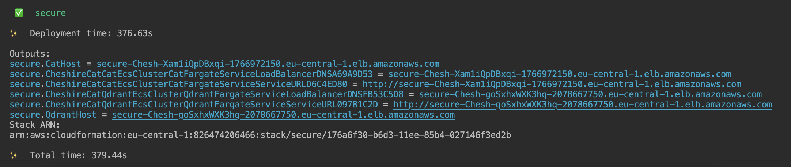
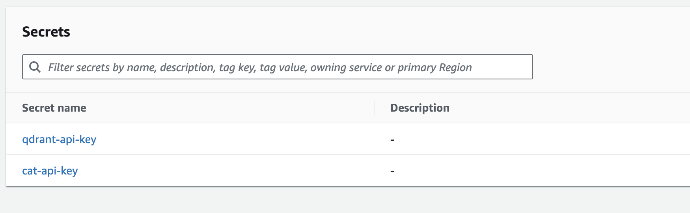

## What is this?

CDK construct library that allows you to create a [Cheshire Cat](https://github.com/cheshire-cat-ai/core) using the AWS Cloud Development Kit (CDK) in TypeScript. The project's infrastructure includes setting up a Qdrant server, the vector search engine, as part of its architecture.

## How to use

1. Configure AWS CLI as per instruction [Installing the AWS CLI version 2](https://docs.aws.amazon.com/cli/latest/userguide/install-cliv2.html)
2. Configure AWS CDK **TypeScript** environment [Getting Started With the AWS CDK](https://docs.aws.amazon.com/cdk/latest/guide/getting_started.html)
3. Run `npm i` to install dependencies
4. Run

## Quickstart

```ts
import { CfnOutput, Stack, StackProps, App } from 'aws-cdk-lib';
import { Construct } from 'constructs';
import { CdkCheshireCat } from 'cdk-cheshire-cat';

export class DefaultCat extends Stack {
  constructor(scope: Construct, id: string, props?: StackProps) {
    super(scope, id, props);

    const cheshireCat = new CdkCheshireCat(this, 'CheshireCat');

    new CfnOutput(this, "CatHost", {
      value: cheshireCat.catEcsCluster.fargateService.loadBalancer.loadBalancerDnsName,
    });
    new CfnOutput(this, "QdrantHost", {
      value: cheshireCat.qdrantEcsCluster.fargateService.loadBalancer.loadBalancerDnsName,
    });
  }
}

const app = new App();
new DefaultCat(app, 'default');
```

### Deployment

1. Run `cdk bootstrap`
2. Run `cdk deploy`
3. Wait a few minutes for the deployment to complete
   
4. Go to CatHost output url with /admin to access the CheshireCat admin
5. Go to QdrantHost output url with /dashboard to access the Qdrant Server dashboard

## Infrastructure (AWS)

* **ECS Cluster (Fargate) for Qdrant:** Hosts the Qdrant server, integrated with EFS for data storage and retrieval.
* **ECS Cluster (Fargate) for Cheshire Cat:** Dedicated cluster running the Docker container of the Cheshire Cat application.
* **EFS (Elastic File System):** Centralized storage for persistent data, utilized by both the Qdrant server and the Cheshire Cat application.

## Examples

### All default

The simplest example shows all defaults below.

```ts
import { CfnOutput, Stack, StackProps, App } from 'aws-cdk-lib';
import { Construct } from 'constructs';
import { CdkCheshireCat } from 'cdk-cheshire-cat';

export class DefaultCat extends Stack {
  constructor(scope: Construct, id: string, props?: StackProps) {
    super(scope, id, props);

    const cheshireCat = new CdkCheshireCat(this, 'CheshireCat');

    new CfnOutput(this, "CatHost", {
      value: cheshireCat.catEcsCluster.fargateService.loadBalancer.loadBalancerDnsName,
    });
    new CfnOutput(this, "QdrantHost", {
      value: cheshireCat.qdrantEcsCluster.fargateService.loadBalancer.loadBalancerDnsName,
    });
  }
}

const app = new App();
new DefaultCat(app, 'default');
```

The initial deployment takes a few minutes, after which a URL for CheshireCat and one for Qdrant Server will appear in the terminal. After a few minutes of adjustment, the services will be available at the relevant URLs.

By default, all the following are created:

* A VPC
* An Internet-facing load balancer serving HTTP (not HTTPS) traffic for CheshireCat server
* An ECS cluster with CheshireCat running on it
* An Internet-facing load balancer serving HTTP (not HTTPS) traffic for Qdrant server
* An ECS cluster with Qdrant server running on it
* An EFS mounted on both qdrant and cheshirecat tasks to storage permanent data

### Custom Cat Image

If you need to use a custom docker image for the cat you can replace the default one like this:

```typescript
import { CfnOutput, Stack, StackProps } from 'aws-cdk-lib';
import { Construct } from 'constructs';
import { CdkCheshireCat } from 'cdk-cheshire-cat';
import * as ecs from 'aws-cdk-lib/aws-ecs'
import * as cdk from 'aws-cdk-lib'
import * as path from 'path'

export class CustomCatImage extends Stack {
  constructor(scope: Construct, id: string, props?: StackProps) {
    super(scope, id, props);
  
    // You have to link the Dockerfile folder, for example ./core
    const image = ecs.ContainerImage.fromAsset(path.resolve(__dirname, 'core'))

    const cheshireCat = new CdkCheshireCat(this, 'CheshireCat', {
      overrides: {
        catEcsCluster: {
          fargateService: {
            taskImageOptions: {
              image
            }
          }
        }
      }
    });

    new CfnOutput(this, "CatHost", {
      value: cheshireCat.catEcsCluster.fargateService.loadBalancer.loadBalancerDnsName,
    });
    new CfnOutput(this, "QdrantHost", {
      value: cheshireCat.qdrantEcsCluster.fargateService.loadBalancer.loadBalancerDnsName,
    });
  }
}

const app = new cdk.App();
new CustomCatImage(app, 'custom-cat-image');
```

### Secure Cat

To run a Cheshire Cat ready for production you definitely need to secure both the cat and the qdrant server by setting api keys.
You can set the Cheshire Cat and Qdrant Server api keys by passing the [AWS Secrects](https://docs.aws.amazon.com/cdk/api/v2/docs/aws-cdk-lib.aws_secretsmanager.Secret.html) to the cdk construct.

```typescript
import { CfnOutput, Stack, StackProps } from 'aws-cdk-lib';
import { Construct } from 'constructs';
import { CdkCheshireCat } from 'cdk-cheshire-cat';
import * as ecs from 'aws-cdk-lib/aws-ecs'
import * as cdk from 'aws-cdk-lib'
import * as path from 'path'
import * as sm from 'aws-cdk-lib/aws-secretsmanager';

export class SecureCat extends Stack {
  constructor(scope: Construct, id: string, props?: StackProps) {
    super(scope, id, props);

    const image = ecs.ContainerImage.fromAsset(path.resolve(__dirname, 'core'))

    const catApiKeySecret = new sm.Secret(this, 'CatApiKey', {
      secretName: 'cat-api-key'
    })
    const qdrantApiKeySecret = new sm.Secret(this, 'QdrantApiKey', {
      secretName: 'qdrant-api-key'
    })

    const cheshireCat = new CdkCheshireCat(this, 'CheshireCat', {
      overrides: {
        catEcsCluster: {
          fargateService: {
            taskImageOptions: {
              image
            }
          }
        }
      },
      catApiKeySecret,
      qdrantApiKeySecret,
    });

    new CfnOutput(this, "CatHost", {
      value: cheshireCat.catEcsCluster.fargateService.loadBalancer.loadBalancerDnsName,
    });
    new CfnOutput(this, "QdrantHost", {
      value: cheshireCat.qdrantEcsCluster.fargateService.loadBalancer.loadBalancerDnsName,
    });
  }
}

const app = new cdk.App();
new SecureCat(app, 'secure');

```

In this example, the api key values will be automatically generated by cdk at the first deployment and will be inserted into the AWS Secrets.



If you want to set a custom values for the api keys you can create manually the AWS Secrets and then import it in the cdk stack

```typescript
import { CfnOutput, Stack, StackProps } from 'aws-cdk-lib';
import { Construct } from 'constructs';
import { CdkCheshireCat } from 'cdk-cheshire-cat';
import * as ecs from 'aws-cdk-lib/aws-ecs'
import * as cdk from 'aws-cdk-lib'
import * as path from 'path'
import * as sm from 'aws-cdk-lib/aws-secretsmanager';

export class SecureCat extends Stack {
  constructor(scope: Construct, id: string, props?: StackProps) {
    super(scope, id, props);

    const image = ecs.ContainerImage.fromAsset(path.resolve(__dirname, 'core'))

    const catApiKeySecret = sm.Secret.fromSecretCompleteArn(this, 'CatApiKey', "arn:aws:secretsmanager:<Region>:<AccountId>:secret:SecretName-6RandomCharacters")
    const qdrantApiKeySecret = sm.Secret.fromSecretCompleteArn(this, 'QdrantApiKey', "arn:aws:secretsmanager:<Region>:<AccountId>:secret:SecretName-6RandomCharacters")


    const cheshireCat = new CdkCheshireCat(this, 'CheshireCat', {
      overrides: {
        catEcsCluster: {
          fargateService: {
            taskImageOptions: {
              image
            }
          }
        }
      },
      catApiKeySecret,
      qdrantApiKeySecret,
    });

    new CfnOutput(this, "CatHost", {
      value: cheshireCat.catEcsCluster.fargateService.loadBalancer.loadBalancerDnsName,
    });
    new CfnOutput(this, "QdrantHost", {
      value: cheshireCat.qdrantEcsCluster.fargateService.loadBalancer.loadBalancerDnsName,
    });
  }
}

const app = new cdk.App();
new SecureCat(app, 'secure');
```

### Domain Cat

To run a Cheshire Cat under a custom domain to have SSL protection, you can implement the following example.

To set up this example, keep these considerations in mind:

- The domain specified in the cat configuration must be hosted on Route 53
- You must specify in the cdk stack instance the id of the deployment destination account and the region where the domain certificate is also located

```typescript
import * as cdk from 'aws-cdk-lib';
import { DomainCat } from './stack';
import { CfnOutput, Stack, StackProps } from 'aws-cdk-lib';
import { Construct } from 'constructs';
import { CdkCheshireCat } from 'cdk-cheshire-cat';
import * as ecs from 'aws-cdk-lib/aws-ecs'
import * as path from 'path' 

export class DomainCat extends Stack {
  constructor(scope: Construct, id: string, props?: StackProps) {
    super(scope, id, props);

    const image = ecs.ContainerImage.fromAsset(path.resolve(__dirname, 'core'))

    const cheshireCat = new CdkCheshireCat(this, 'CheshireCat', {
      overrides: {
        catEcsCluster: {
          fargateService: {
            taskImageOptions: {
              image
            }
          }
        }
      },
      domainProps: {
        catDomainProps: {
          domainName: 'example.com',
          subDomain: 'cat'
        },
        qdrantDomainProps: {
          domainName: 'example.com',
          subDomain: 'qdrant'
        }
      }
    });

    new CfnOutput(this, "CatHost", {
      value: cheshireCat.domain?.catDomain.domainName ?? cheshireCat.catEcsCluster.fargateService.loadBalancer.loadBalancerDnsName,
    });
    new CfnOutput(this, "QdrantHost", {
      value: cheshireCat.domain?.qdrantDomain.domainName ?? cheshireCat.qdrantEcsCluster.fargateService.loadBalancer.loadBalancerDnsName,
    });
  }
}

const app = new cdk.App();
new DomainCat(app, 'domain-cat', { env: { account: 'ACCOUNT-ID', region: 'REGION' } });
```

See these example CDK apps [here](./examples).
